Hi there 👋🏻

I am a software engineer, these days primarily an  developing software in  using .

<picture>
  <source width=350 align="center" media="(prefers-color-scheme: dark)" srcset="./images/stats-dark.svg">
  
</picture>

<picture>
  <source width=400 align="center" media="(prefers-color-scheme: dark)" srcset="./images/top-langs-dark.svg">
  
</picture>

<picture>
  <source
    width=350
    align="center"
    srcset="./images/stats-dark.svg"
    media="(prefers-color-scheme: dark)"
  />
  <source
    width=350
    align="center"
    srcset="./images/stats-light.svg"
    media="(prefers-color-scheme: light), (prefers-color-scheme: no-preference)"
  />
  
</picture>

<picture>
  <source
    width=400
    align="center"
    srcset="./images/top-langs-dark.svg"
    media="(prefers-color-scheme: dark)"
  />
  <source
    width=400
    align="center"
    srcset="./images/top-langs-light.svg"
    media="(prefers-color-scheme: light), (prefers-color-scheme: no-preference)"
  />
  
</picture>

