Hi there 👋🏻

I am a software engineer, these days primarily an  developing software in  using .

<picture>
  <source
    width=350
    align="center"
    srcset="./profile/stats.svg"
    media="(prefers-color-scheme: dark)"
  />
  
</picture>

<picture>
  <source
    width=400
    align="center"
    srcset="./profile/top-langs.svg"
    media="(prefers-color-scheme: dark)"
  />
  
</picture>

<!--<picture>
  <source
    width=350
    align="center"
    srcset="https://github-readme-stats.vercel.app/api?username=4np&show_icons=true&custom_title=GitHub%20Statistics&theme=dracula"
    media="(prefers-color-scheme: dark)"
  />
  
</picture>

<picture>
  <source
    width=400
    align="center"
    srcset="https://github-readme-stats.vercel.app/api/top-langs/?username=4np&layout=compact&hide=groovy&langs_count=5&card_width=450&theme=dracula"
    media="(prefers-color-scheme: dark)"
  />
  
</picture>-->
