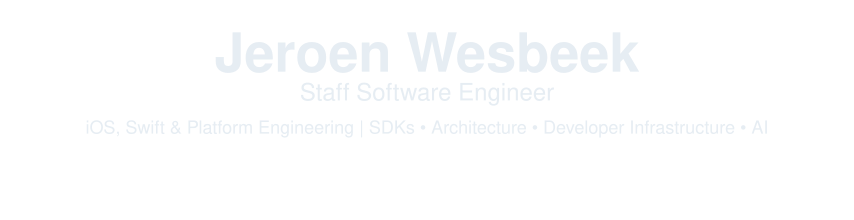

	  
	  
	
	

Hi there , I’m Jeroen.

I’m a software engineer and technologist with 28+ years of hands-on experience across Apple platforms, backend systems, web, infrastructure and DevOps. These days I work primarily with Swift and Apple’s development ecosystem, with a strong interest in software architecture, developer tooling, reliability and building maintainable systems.

I enjoy solving problems across technology boundaries and remain very much a hands-on engineer, while also contributing to technical direction, architecture and mentoring. I also work with AI-assisted and agentic development, including modern coding agents and privacy-preserving, on-device machine learning.

I’m open to new opportunities. The quickest way to reach me is via [LinkedIn](https://www.linkedin.com/in/jeroenwesbeek).

---

	<picture>
	  <source
	    media="(prefers-color-scheme: dark)"
	    srcset="https://raw.githubusercontent.com/4np/4np/output/github-contribution-grid-snake-dark.svg"
	  />
	  <source
	    media="(prefers-color-scheme: light)"
	    srcset="https://raw.githubusercontent.com/4np/4np/output/github-contribution-grid-snake.svg"
	  />
	  
	</picture>

---

	
	
	
	
	
	
	
	
	
	
	
	
	
	
	
	
	
	
	
	
	
	
	
	
	
	
	
	
	
	
	
	 
	

